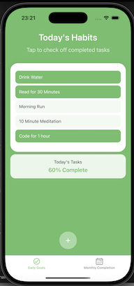

# HabitTap

**HabitTap** is a mobile application built with **React Native** and **JavaScript** that helps users build and maintain positive habits through simple daily tracking, customizable reminders, and motivational visual feedback. Designed for students, professionals, and anyone on a journey of personal development, HabitTap offers an intuitive and clean interface to encourage long-term consistency and goal achievement.

---

## 🎯 Design and Purpose

HabitTap was created to simplify the habit formation process by providing a lightweight, offline-friendly mobile app for daily tracking. The core goal is to make habit-building approachable and sustainable by reducing friction in tracking and offering motivational feedback through visuals like streak counters and calendar history.

The app focuses on three key principles:
- **Simplicity** – Users can complete tasks with just one tap.
- **Mobility** – Designed for quick, on-the-go check-ins.
- **Motivation** – Visual progress and streak tracking keep users engaged.

**Target Audience**:
- Students managing study habits or wellness routines  
- Professionals balancing productivity and self-care  
- Anyone looking for a practical digital tool to support personal growth

---
## 🔗 Server API Design and Specification

Although HabitTap does not use a traditional remote server, the app is structured around clear data operations powered by a local SQLite database. These operations are modeled after RESTful API principles to ensure clarity and maintainability of the codebase.

### 📥 Get All Habits
- **Operation**: Retrieve all stored habits
- **Logic**:
  - Query all records from the `habits` table
  - Return an array of habit objects with their completion status
- **Example Result**:
```json
[
   { "id": "1", "title": "Drink Water", "completed": true },
   { "id": "2", "title": "Read for 30 Minutes", "completed": false }
]
```

### ➕ Add New Habit
- **Operation**: Insert a new habit into the database
- **Inputs**:
```json
{
   "id": "1686438290000",
   "title": "Stretch for 5 min",
   "completed": false
}
```
- **Logic**:
   - Insert a new record with a unique ID, title, and completion status (0 for false, 1 for true)

### 🔄 Toggle Habit Status
- **Operation**: Update the `completed` status of a specific habit
- **Inputs**:
```json
{
   "id": "1",
   "completed": true
}
```
- **Logic**:
   - Locate the habit in the database using the id
   - Update the completed field to reflect the new status (0 for false, 1 for true)
---

## 📸 Screenshots

1. **Home Screen – Daily Checklist**  
   Displays the list of today's habits with a tap-to-complete interface.  
   

2. **Habit Creation Screen**  
   Users can add new habits, name them, and set desired frequency.  
   

3. **Calendar View**  
   Visualizes habit completion over time, helping users spot trends and maintain streaks.  
   

---

## Key Features

* **Daily Habit Checklist**: Track habits easily with a one-tap daily completion system
* **Create/edit/delete habits**:  Easily manage your goals by creating new habits, updating existing ones, or removing those that no longer serve you
* **Streak counters & calendar views**: View streaks and completion history via calendar or streak counter
* **Push notifications**: Get timely reminders to complete your habits and stay consistent with your daily routine
* **Secure login (Firebase/Supabase)**: SQLite

---

## 🛠 Tech Stack

* **Frontend**: React Native (Expo), JavaScript
* **Backend**: SQLite
* **Authentication**: SQLite

---

## 🚀 Getting Started

1. **Clone the repo**

```bash
git clone https://github.com/dgthomp3/habit-tap.git
cd habit-tap
```

2. **Install dependencies**

```bash
npm install
```

3. **Start the app**

```bash
npx expo start
```

---

## Experiences

### Design & Development Process

This project was developed as part of a course assignment with an emphasis on both individual creativity and collaborative problem-solving. The team began with brainstorming sessions to align on user needs, feature scope, and technical feasibility. We shared tasks across frontend development, database integration, and interaction design, checking in regularly to merge progress and address blockers.

### Major Challenges & Solutions

- **Offline Persistence**: We initially planned to use Firebase, but shifted entirely to SQLite to better support offline usage. This required learning how to manage schema creation, asynchronous queries, and state syncing locally.
- **Consistent UI Across Platforms**: Styling in React Native sometimes rendered differently on Android vs iOS, which required frequent testing and refinement to ensure a consistent user experience.
- **Task Distribution & Merge Conflicts**: Coordinating Git commits among team members led to some merge conflicts. We resolved this by introducing clearer Git flow practices and consistent communication on file ownership.

### Techniques & Best Practices Used

- Component-based architecture with reusable, theme-consistent elements
- Local-first data architecture using SQLite with async handling
- Modular code organization to allow team members to work in parallel
- Peer code reviews before major merges

### Future Plans

- Habit sharing with friends
- CSV/JSON data export for analysis or journaling
- Personalized analytics and visual feedback on progress
- Theming and accessibility customization

### Reflection

Working as a team on HabitTap allowed us to sharpen not only our technical skills but also our ability to divide and conquer features, align design visions, and problem-solve collectively. It was an exercise in both engineering and effective collaboration.
